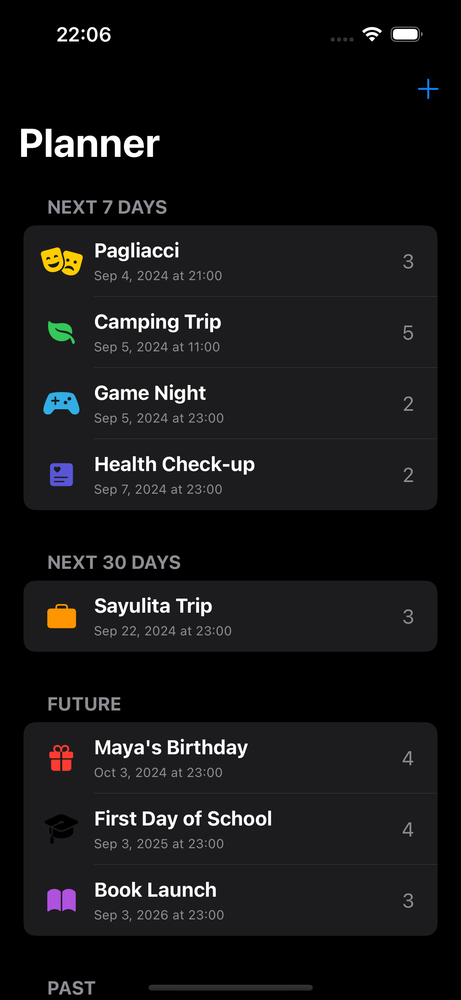
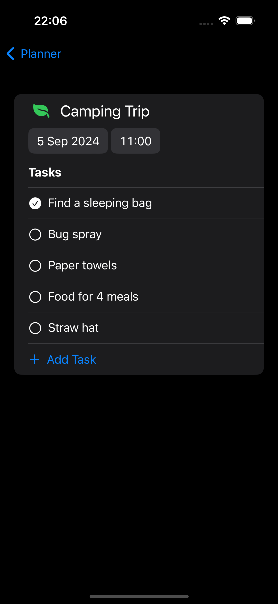
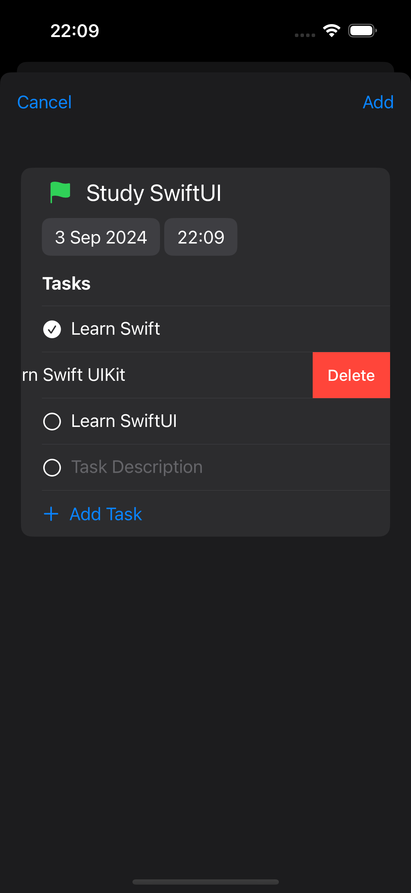

# Planner

<details close>
  <summary>Uygulamaya ait ekran görüntülerini görmek için tıklayın.</summary>
    
</details>

## Teknoloji

SwiftUI

## Özellikler

- Etkinlik oluşturabilmek, silebilmek ve güncelleyebilmek.
- Oluşturulan etkinliğe ait alt görevler ekleyebilmek, silebilmek ve güncelleyebilmek.
- Oluşturulan etkinlikleri silmek isteyene dek cihazın hafızasında saklayabilmek.

## Kurulum

Bu depoyu yerel makinenizde klonlayın.

```
git clone https://github.com/ibrahimaykutbas/planner.git
```

### Hazırlık

Projeyi klonladıktan sonra ilgili dizine gidin.

```
cd planner
open Planner.xcodeproj
```

Bu talimatlar, geliştirme ve test amacıyla yerel makinenizde projenin bir kopyasını hazır hale getirecektir.
